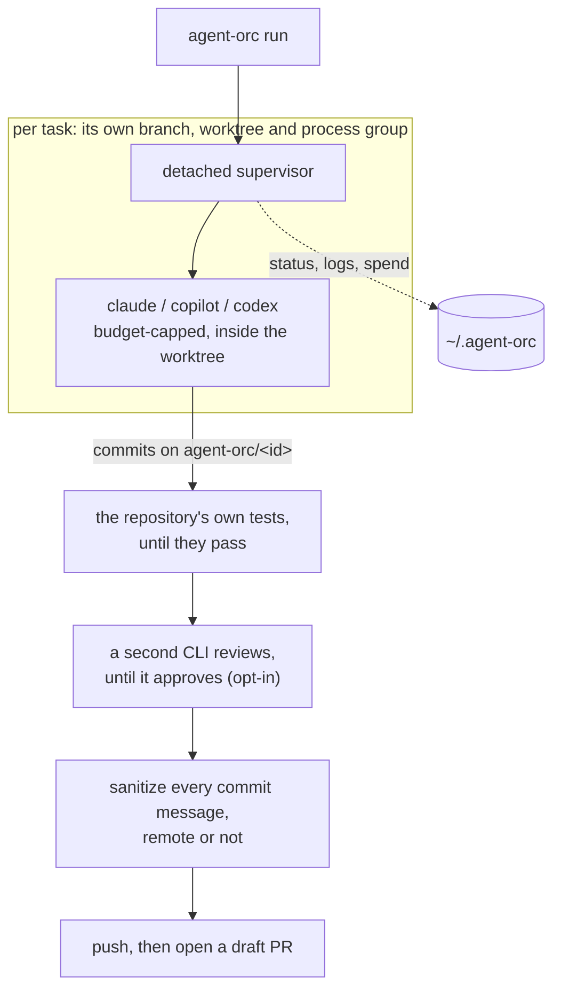
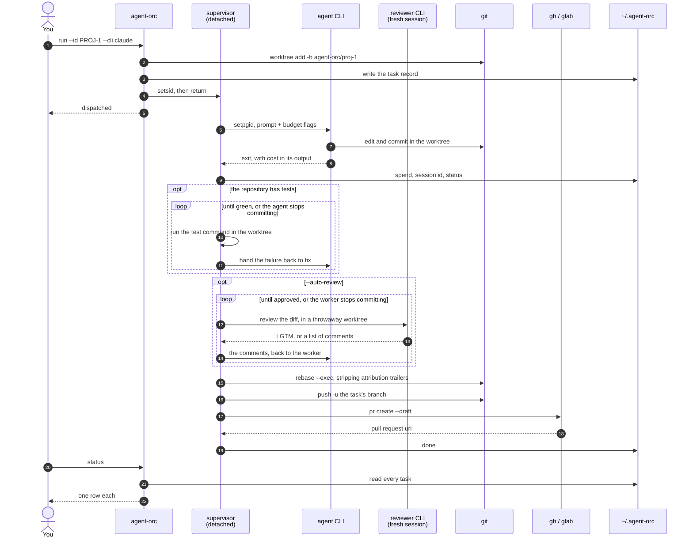

# agent-orc


Run several agentic coding CLIs at once, each on its own task, each in its own
git worktree, and get a draft PR out of every one that succeeds.

Give it a JIRA ticket, a GitHub issue or a plain prompt. For each task it cuts a
branch, launches the agent you chose inside an isolated worktree, caps what the
run may spend, then sanitizes the commits and opens a draft PR.

It is a dispatcher, not an agent runtime. It never talks to a model: it shells
out to CLIs you already have. Worktrees do the isolation, the OS does the
concurrency, files do the state keeping. No daemon, no database.

## How it works

One process per task, no daemon and no database. `run` returns as soon as a task
is dispatched; a detached supervisor drives it from there, and several tasks run
this way at once without touching each other.



Both gates hand their findings back to the agent and run again, so each one
stops the next being wasted: no reviewer reads a branch whose suite is red, and
no PR opens over a branch the review is still changing. They run until they
succeed rather than to a quota, bounded by the budget the CLIs enforce and by
the agent no longer changing anything. Sanitization runs whether or not there is
a remote: it is about the history, not the push.

### A task, end to end



### What it talks to

agent-orc adds no runtime of its own, and never talks to a model: the agent
CLIs do that. Everything it uses is the OS or a binary you already have.

| | |
| --- | --- |
| `setsid` | the supervisor outlives the shell that started it |
| `setpgid` | `stop` reaches the agent's children, not just the agent |
| signal 0 | is that process group still alive? |
| `git` | worktrees, commits, `rebase --exec`, push |
| `claude` / `copilot` / `codex` | argv built by the adapter for that CLI |
| `gh` / `glab` | `pr create --draft`, `issue view --json` |
| JIRA REST | one request, response capped at 1 MiB |
| `~/.agent-orc` | one JSON file per task, written to a temp file then renamed |

## Install

Linux and macOS. Task isolation is built out of process groups, signals and
file locks, so there is no Windows build.

Download a binary from the [latest release](https://github.com/MaryannGitonga/agent-orc/releases/latest):

```sh
VERSION=$(gh release view --repo MaryannGitonga/agent-orc --json tagName -q .tagName)
OS=$(uname -s | tr '[:upper:]' '[:lower:]')   # linux or darwin
ARCH=$(uname -m | sed 's/x86_64/amd64/;s/aarch64/arm64/')
gh release download "$VERSION" --repo MaryannGitonga/agent-orc \
  --pattern "agent-orc_${VERSION}_${OS}_${ARCH}.tar.gz"
tar -xzf agent-orc_${VERSION}_${OS}_${ARCH}.tar.gz
sudo install agent-orc_${VERSION}_${OS}_${ARCH} /usr/local/bin/agent-orc
```

Each release also ships `checksums.txt`. Or build it yourself:

```sh
git clone https://github.com/MaryannGitonga/agent-orc
cd agent-orc
make build          # produces bin/agent-orc
```

You also need at least one agentic CLI on PATH (`claude`, `copilot` or
`codex`), and `gh` if you want GitHub sources or draft PRs.

## Quick start

```sh
agent-orc run --id PROJ-1234 --cli claude \
  --prompt "Fix the null-pointer in the FX sync retry handler"
```

`run` returns as soon as the task is dispatched. A detached supervisor drives
the agent in the background, so closing the terminal does not stop it. Watch it
with `agent-orc status`, and read its output with `agent-orc logs PROJ-1234 -f`.

### Flags

| Flag | Default |
| --- | --- |
| `--id` | required; names the branch, worktree, log and state file |
| `--cli` | required; `claude`, `copilot` or `codex` |
| `--prompt` / `--source` | one of the two is required |
| `--repo` | the current directory |
| `--base-branch` | the repository's default branch |
| `--branch` | `agent-orc/<id>` |
| `--model` | the CLI's own default |
| `--auto-review` | off; review is triggered by hand |
| `--review-cli` | a CLI other than `--cli` |

There is no default CLI on purpose: agent-orc dispatches to whichever agent you
actually have, and checks the binary is on PATH before creating anything.

## Commands

| Command | What it does |
| --- | --- |
| `run --id <id> --cli <name> ...` | dispatch one task |
| `run <tasks.yaml>` | dispatch a batch |
| `status` | one row per task: status, spend, branch, elapsed |
| `logs <id> [-f] [--raw]` | print the agent's output, or follow it until the task ends |
| `stop <id>` | terminate the agent, or the tests or reviewer running after it, and everything they spawned |
| `pr <id>` | run the publish chain by hand, or retry one that failed |
| `review <id>` | run an agentic review round |
| `cleanup <id\|--all> [--force] [--delete-branch]` | remove the worktree and state; keep the branch unless told otherwise |
| `version` | print the version |

`logs` summarizes as it prints. A CLI that reports its result as JSON writes
one very long line holding the answer buried in token accounting, so that line
becomes the answer plus a short footer:

```
Added the optional greeting parameter and a test covering both cases.

status   success, 10 turns, 30.7s
cost     $0.1147
session  6fb7fb30-eef3-4704-942e-d71d9c084be9
```

`-f` follows the log until the task finishes. It also stops if the id is
cleaned up and dispatched again while you are watching, since the run you asked
for is gone and its log will never grow again.

Only a CLI that reports through a JSON envelope is summarized. One that answers
in prose is copied through byte for byte, JSON it happened to print included,
because its output is the record of what it did. `--raw` prints any log exactly
as it was written, for piping it into something else.

## Task sources

A ticket reference can stand in for the prompt. It is fetched once, at launch,
and any prompt you also pass is layered on top as extra instructions:

```sh
agent-orc run --id PROJ-1240 --cli claude --source github://acme/data-mesh#87
agent-orc run --id PROJ-1234 --cli claude --source jira://PROJ-1234 \
  --prompt "Only the retry handler"
```

GitHub reuses the `gh` login you already have. JIRA needs `JIRA_BASE_URL` and
`JIRA_API_TOKEN` in the environment, plus `JIRA_USER_EMAIL` on Cloud, which
authenticates with basic auth rather than a bearer token.

JIRA requests use REST v2, which Server and Data Center use natively and Cloud
still accepts; set `JIRA_API_VERSION=3` for an instance that requires it. The
description is read either way: v2 returns a plain string and v3 an Atlassian
Document Format tree, and both are flattened into the prompt. Only the first
1 MiB of a response is read, so an enormous issue cannot be loaded into memory
whole; one that exceeds the cap is refused by size rather than being truncated
into a parse error.

A source that cannot be fetched fails the launch before anything is created on
disk, rather than starting an agent on a guess.

## Batch runs

Put the tasks in a YAML file (see [`examples/tasks.yaml`](examples/tasks.yaml))
and pass it instead of the flags:

```sh
agent-orc run tasks.yaml
```

`defaults` applies to every task and any task can override any field. Tasks are
independent: each gets its own branch, worktree and process, so one that cannot
launch does not stop the others.

## Budgets

Each CLI meters in its own unit, and agent-orc does not invent an exchange rate
between them. Set the budget in the unit your CLI understands and it is applied
as that CLI's own native cap at launch:

| CLI | Batch field | Flag | Native cap |
| --- | --- | --- | --- |
| claude | `budget_usd` | `--budget-usd` | `--max-budget-usd` |
| copilot | `budget_credits` | `--budget-credits` | `--max-ai-credits` |
| codex | none | none | none; reported, not enforced |

A budget the CLI cannot enforce is not silently dropped: it is warned about at
launch and noted under `agent-orc status`. Actual spend is read back out of the
CLI's own output afterwards, where it reports one.

## Publishing

When the agent exits, the same per-task process sanitizes its commits, pushes
the branch and opens a **draft** PR. Nothing reaches the remote unsanitized.

`--no-auto-pr` holds off, and `agent-orc pr <id>` runs the three steps by hand.
That is also how to retry a task whose push landed but whose draft-open did not:
it recognises a branch it pushed itself, so the retry finishes the job rather
than mistaking it for one the agent pushed.

A repository with no `origin` is a legitimate way to work: commits are still
sanitized and the task ends `done` on its branch. An agent that committed
nothing ends `done` too, with the log saying the branch is empty, unless there
is a remote, in which case it is `publish_failed`, because a draft PR someone is
waiting for will never appear.

### Statuses

| Status | Meaning |
| --- | --- |
| `pending` | dispatched; the agent has not started yet |
| `running` | the agent is working |
| `verifying` | the task's own test command is running |
| `reviewing` | an automatic review round is under way |
| `publishing` | the sanitize, push and draft-PR chain is running |
| `done` | published as a draft PR, or sanitized and left on the branch when there is no remote |
| `publish_failed` | no draft PR was opened: the chain stopped part way, or the agent committed nothing |
| `failed` | the agent exited non-zero or never launched, or the test command never passed |
| `stopped` | you killed it with `agent-orc stop` |
| `reviewed` | an agentic review round approved the branch |
| `review_failed` | an automatic review could not finish; the work is on its branch, retry with `agent-orc review` |
| `policy_violation` | the agent pushed its own branch, bypassing sanitization |

## Commit sanitization

When a task finishes, every commit it added is rewritten in one pass, before
anything is pushed and whether or not there is anywhere to push to:

- **AI attribution trailers are removed**: `Co-authored-by:` naming Claude,
  Copilot, Codex or any `[bot]`, plus `Claude-Session:`, `Assisted-by:`,
  `Generated-with:` and `Generated with [Claude Code]`. Each CLI is also asked
  not to add them, but those settings are inconsistently honoured and an agent
  crafting a raw `git commit` bypasses them, so the rewrite never depends on
  them working. Add your own patterns to `~/.agent-orc/trailers.txt`, one
  regular expression per line.
- **`Signed-off-by:` is added** to commits missing one when `dco_signoff: true`
  (or `--dco-signoff`) is set. It is the one trailer never stripped.
- **GPG signing needs nothing new.** A worktree shares the parent repo's config,
  so if `commit.gpgsign=true` is set, the agent's commits and the rewrite are
  signed exactly as yours would be.

Only commits unique to the task's own branch are touched, in the task's own
worktree. The pass rewrites messages and nothing else, so a branch containing a
merge keeps it rather than being flattened. If the rewrite cannot complete it is
aborted and the branch is left exactly as the agent made it; a half-rewritten
branch is never pushed.

If the agent pushes its own branch despite being told not to, that branch never
went through this pass, so the task is flagged `policy_violation` rather than
treated as though agent-orc had published it.

## Test verification

agent-orc works out how your repository runs its own tests, runs them in the
worktree once the agent has finished, hands any failure back to the agent to
fix, and refuses to publish while they are red. No configuration:

| Found in the repository | Command |
| --- | --- |
| a `test:` target in a `Makefile` | `make test` |
| `go.mod` | `go test ./...` |
| a `test` script in `package.json` | `npm test` |
| `Cargo.toml` | `cargo test` |
| a pytest section in `pyproject.toml`, `setup.cfg` or `tox.ini`, a `pytest.ini`, or `test_*.py` files | `python -m pytest -q` |

The `Makefile` comes first: a repository that wrote a test target has already
decided. `test-unit` and `test-integration` are not a `test` target, so a
repository with only those is left alone rather than failing on a missing rule.
The pytest row reads those files rather than trusting their names, because a
`pyproject.toml` usually belongs to packaging or a linter, and pytest is the one
convention here that fails a project for having no tests.

What was found is reported at dispatch and named in the agent's operating rules,
so the agent runs the same command agent-orc is about to:

```
PROJ-1234  started
  branch    agent-orc/proj-1234 (from main)
  tests     python -m pytest -q (from a pytest layout)
```

There is no flag for it. How a project is tested is a fact about the project,
not about one run, so the override lives in the repository's own file:

```yaml
# .agent-orc.yaml
test_command: pytest -q -m "not slow"   # when discovery does not describe it
test_timeout: 10m                       # cap per run; 30m default, "none" for no cap
```

`test_command: none` turns verification off for a suite agent-orc should not be
running, and stops the agent being asked about tests at all. When nothing is
found and nothing is set, the agent is still asked to find and run the project's
tests. That instruction is worth having but is not the mechanism: an agent asked
to iterate until green will sometimes stop short and say it did, and the branch
would look finished either way.

There is no attempt cap. Three real conditions end the loop: the tests pass, the
agent's CLI ends the session, which is how a budget is enforced, or the agent
commits nothing in a round, a fixed point since the next run would be identical.
A run killed at the timeout is reported as killed rather than as a failing
suite. A CLI that cannot resume a session, which is Codex, gets one run and no
loop; the branch is still blocked if it is red.

`agent-orc stop` reaches all of it: the command runs in its own process group
with its pid on the record, and a stop recorded between two commands is honoured
before the next one starts.

## Agentic review

Off by default. `--auto-review` runs a review the moment the agent finishes and
before the branch is published, so the draft PR that opens has already been
through a round:

```sh
agent-orc run --id PROJ-1234 --cli claude --prompt "..." --auto-review
```

`--review` instead allows `agent-orc review <id>` to be run by hand later.
Asking for review on finishing is asking for review, so `auto` implies
`enabled`, in a batch file and the settings layers as well as on the flags.

The reviewer is a fresh session in its own disposable worktree, never a resume
of the worker's: one that inherited the worker's conversation would inherit its
framing of the problem too. It sees the diff and the original task, the way a
human reviewer sees the PR and not the author's scratch work. Left unconfigured
it runs on a different CLI from the worker, so the two are less likely to share
a blind spot.

It answers `LGTM` or a list of concrete comments. Comments go back to the
worker's own session, resumed by the session id assigned at launch. Anything
that is neither stops the round and waits for a human rather than guessing.

There is no round cap: a change reviewed but not approved is not a reviewed
change, and stopping at some number would publish it anyway. The same two
conditions bound this as the test loop, the budget and a worker that stops
acting on the comments. Worker and reviewer never run at the same time, and a
round draws on the same per-task budget rather than a separate pool. None of it
replaces the human "Ready for review" click.

Codex tasks cannot be reviewed: Codex sessions cannot be resumed, so there is
nowhere to send the feedback. agent-orc says so rather than silently starting
the worker over.

## Subagents

`subagents: true` (or `--subagents`) copies subagent definitions into the
worktree before launch, into the directory that CLI already reads
(`.claude/agents` for Claude Code, `.github/agents` for Copilot). Definitions
come from `~/.agent-orc/agents/<cli>/`, falling back to whatever the repository
ships. They are ignored inside the worktree so the agent does not commit them.

That ignore covers untracked files, which is what a seeded definition normally
is. It cannot hide one that landed on a path the repository already tracks,
because git does not consult `.gitignore` for tracked files. agent-orc warns at
launch when that happens rather than letting it pass quietly.

## Defaults

Standing instructions say how work is done. Defaults say how a run is
configured, and exist so the same flags are not retyped every time. They come
from two optional files:

```sh
cat ~/.agent-orc/defaults.yaml       # true of every task on this machine
cat myrepo/.agent-orc.yaml           # true of that repository, checked in
```
```yaml
cli: claude
model: claude-sonnet-5
dco_signoff: true
review:
  enabled: true
  auto: true          # review on finishing, before the PR opens
  cli: claude
  model: claude-opus-5
```

With that in place, a run is only the part that is actually about this task:

```sh
agent-orc run --id PROJ-1234 --prompt "Fix the retry handler"
```

Four layers, narrowest wins:

| Layer | Where | For |
| --- | --- | --- |
| machine | `~/.agent-orc/defaults.yaml` | how you work, everywhere |
| repository | `<repo>/.agent-orc.yaml` | what is true of that codebase |
| batch | a batch file's `defaults` | one run of many tasks |
| task | a flag, or a batch entry | this task alone |

The keys follow the run flags, dashes swapped for underscores, so there is one
vocabulary rather than three: `cli`, `model`, `base_branch`, `subagents`,
`budget_usd`, `budget_credits`, `auto_pr`, `dco_signoff`, and the `review` block
(`enabled`, `auto`, `cli`, `model`). `test_command` and `test_timeout` follow
the same naming but have no flag of their own: how a project is tested is a
fact about the project, so it is set in a file or discovered, never per run.

What is inherently per-task cannot be defaulted: the id, the prompt or source,
the branch, and the repository. A repository's file is read from the top of its
working tree, so it applies whether you run from the root or deep inside it.

Four rules govern the layering:

- A flag you type always wins; a flag you leave off is not an override, so
  `--cli copilot` does not disturb an inherited `dco_signoff`.
- A narrower layer can turn a setting off as well as on: `auto_pr: false` in a
  repository beats `auto_pr: true` on the machine.
- An empty value means "not set here", never "back to the default". Override an
  inherited `test_timeout: none` by naming the duration you want.
- Unknown keys are rejected, so a typo fails where it was made.

## Standing instructions

A task's prompt says what to do. Standing instructions say how work is done
here, and are added to every task rather than repeated in each one:

```sh
cat ~/.agent-orc/instructions.md
```
```
Run `make ci` before committing.
Prefer the standard library; justify any new dependency in the commit body.
```

A batch can add its own on top, for rules that apply to that run rather than to
the machine:

```yaml
defaults:
  cli: claude
  instructions: |
    This service is on the 2.x API. Do not use the deprecated v1 client.
```

The two add up, broadest first, and land between the task and agent-orc's own
operating rules, so an agent can tell what it was asked to do from how it is
expected to do it. Neither is given to a reviewer: it is not doing the work, so
rules about how the work is done do not apply to it.

Repository-level instruction files that a CLI already reads keep working
untouched, because the agent runs in a worktree of your repository: `CLAUDE.md`
for Claude Code, `AGENTS.md` for Codex, `.github/copilot-instructions.md` for
Copilot. Use those for anything that belongs to the repository, and
`instructions.md` for anything that belongs to you.

## Files on disk

Everything lives under `~/.agent-orc`, overridable with `AGENT_ORC_HOME`:

```
~/.agent-orc/
  state/PROJ-1234.json          status, branch, pid, exit code, spend
  logs/PROJ-1234.log            the agent's own output
  logs/PROJ-1234.supervisor.log what agent-orc did around it
  worktrees/PROJ-1234/          the isolated checkout
  reviews/PROJ-1234/            a review round's disposable checkout
  agents/claude/*.md            your subagent definitions, seeded on request
  instructions.md               standing instructions added to every prompt
  defaults.yaml                 machine-wide task defaults
  trailers.txt                  extra sanitization patterns, one per line
```

`agent-orc cleanup <id>` removes the worktree and state and keeps the branch,
because the branch is the work. Logs go only with `--force`, which also gets
past a worktree that cannot be inspected at all: cleanup stops on a permission
or mount problem rather than removing the record and leaving a checkout nothing
points at.

The branch goes only with `--delete-branch`, which refuses one holding commits
that are neither in its base branch nor pushed. That question is asked against
the base the task was cut from, not whatever the repository has checked out,
which is what `git branch -d` would ask and the wrong question for a task
branch. It is also the one-step way to free an id you want to reuse; the new
task starts with empty logs.

## Development

```sh
make help             # list every target
make ci               # everything the workflows check; run before pushing
make build            # compile to bin/agent-orc
make test-unit        # unit tests
make test-integration # the tests that shell out to real git and gh
make coverage         # total coverage, unit and integration merged
```

Requires Go 1.22+ and `golangci-lint` (`make lint-install` fetches the pinned
version).

Conventions for commits, pull requests, code and tests are in
[CONTRIBUTING.md](CONTRIBUTING.md). Commits are checked by CI: one-line
conventional subject, DCO sign-off, GPG signature, and no AI-attribution
trailers. `make commit-check` runs the same check locally.

## License

MIT. See [LICENSE](LICENSE).
