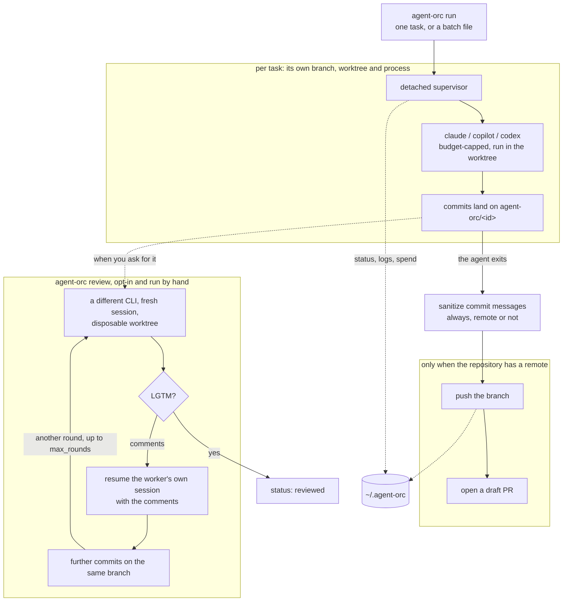
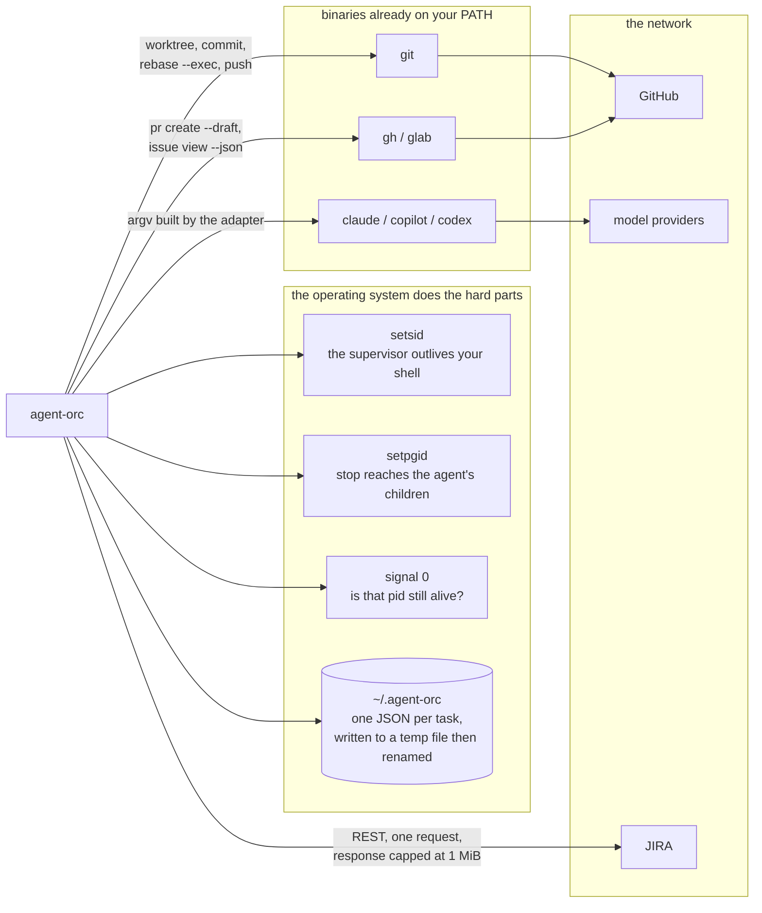

# agent-orc

[](https://github.com/MaryannGitonga/agent-orc/actions/workflows/ci.yml)
[](https://github.com/MaryannGitonga/agent-orc/actions/workflows/commit-policy.yml)


Run several agentic coding CLIs at once, each on its own task, each in its own
git worktree, and get a draft PR out of every one that succeeds.

Give it a JIRA ticket, a GitHub issue or a plain prompt. For each task it cuts a
branch, launches the agent you chose inside an isolated worktree, caps what the
run may spend, then sanitizes the commits and opens a draft PR.

It is a dispatcher, not an agent runtime. It never talks to a model: it shells
out to CLIs you already have. Worktrees do the isolation, the OS does the
concurrency, files do the state keeping. No daemon, no database.

## How it works

One process per task, no daemon and no database. `run` returns as soon as each
task is dispatched; a detached supervisor drives the agent from there.



Several tasks run this way at once, each with its own branch, worktree and
supervisor, so one that fails does not touch the others. The publish chain hangs
off the process that was already running for that task, which is what makes it
automatic without anything running in the background. Review is separate and
opt-in: it never runs on its own, and it works on the same branch the worker
committed to.

Sanitization runs whether or not there is a remote: it is about the history, not
about the push.

### What it talks to

agent-orc adds no runtime of its own. Everything below is either the operating
system or a binary you already have, and it never talks to a model itself: the
agent CLIs do that.



## Install

Download a binary from the [latest release](https://github.com/MaryannGitonga/agent-orc/releases/latest):

```sh
VERSION=v0.1.0
OS=$(uname -s | tr '[:upper:]' '[:lower:]')   # linux or darwin
ARCH=$(uname -m | sed 's/x86_64/amd64/;s/aarch64/arm64/')
gh release download "$VERSION" --repo MaryannGitonga/agent-orc \
  --pattern "agent-orc_${VERSION}_${OS}_${ARCH}.tar.gz"
tar -xzf agent-orc_${VERSION}_${OS}_${ARCH}.tar.gz
sudo install agent-orc_${VERSION}_${OS}_${ARCH} /usr/local/bin/agent-orc
```

Each release also ships `checksums.txt`. Or build it yourself:

```sh
git clone https://github.com/MaryannGitonga/agent-orc
cd agent-orc
make build          # produces bin/agent-orc
```

While the repository is private, `go install` needs
`GOPRIVATE=github.com/MaryannGitonga/*` and a credential helper, so the release
binary or a local build is the easier route.

You also need at least one agentic CLI on PATH (`claude`, `copilot` or
`codex`), and `gh` if you want GitHub sources or draft PRs.

## Quick start

```sh
agent-orc run --id PROJ-1234 --cli claude \
  --prompt "Fix the null-pointer in the FX sync retry handler"
```

`run` returns as soon as the task is dispatched. A detached supervisor drives
the agent in the background, so closing the terminal does not stop it. Watch it
with `agent-orc status`, and read its output with `agent-orc logs PROJ-1234 -f`.

### Flags

| Flag | Default |
| --- | --- |
| `--id` | required; names the branch, worktree, log and state file |
| `--cli` | required; `claude`, `copilot` or `codex` |
| `--prompt` / `--source` | one of the two is required |
| `--repo` | the current directory |
| `--base-branch` | the repository's default branch |
| `--branch` | `agent-orc/<id>` |
| `--model` | the CLI's own default |

There is no default CLI on purpose: agent-orc dispatches to whichever agent you
actually have, and checks the binary is on PATH before creating anything.

## Commands

| Command | What it does |
| --- | --- |
| `run --id <id> --cli <name> ...` | dispatch one task |
| `run <tasks.yaml>` | dispatch a batch |
| `status` | one row per task: status, spend, branch, elapsed |
| `logs <id> [-f] [--raw]` | print the agent's output, or follow it until the task ends |
| `stop <id>` | terminate a running agent and everything it spawned |
| `pr <id>` | run the publish chain by hand, or retry one that failed |
| `review <id>` | run an agentic review round |
| `cleanup <id\|--all> [--force] [--delete-branch]` | remove the worktree and state; keep the branch unless told otherwise |
| `version` | print the version |

`logs` summarizes as it prints. A CLI that reports its result as JSON writes
one very long line holding the answer buried in token accounting, so that line
becomes the answer plus a short footer:

```
Added the optional greeting parameter and a test covering both cases.

status   success, 10 turns, 30.7s
cost     $0.1147
session  6fb7fb30-eef3-4704-942e-d71d9c084be9
```

Only a CLI that reports through a JSON envelope is summarized. One that answers
in prose is copied through byte for byte, JSON it happened to print included,
because its output is the record of what it did. `--raw` prints any log exactly
as it was written, for piping it into something else.

## Task sources

A ticket reference can stand in for the prompt. It is fetched once, at launch,
and any prompt you also pass is layered on top as extra instructions:

```sh
agent-orc run --id PROJ-1240 --cli claude --source github://acme/data-mesh#87
agent-orc run --id PROJ-1234 --cli claude --source jira://PROJ-1234 \
  --prompt "Only the retry handler"
```

GitHub reuses the `gh` login you already have. JIRA needs `JIRA_BASE_URL` and
`JIRA_API_TOKEN` in the environment, plus `JIRA_USER_EMAIL` on Cloud, which
authenticates with basic auth rather than a bearer token.

JIRA requests use REST v2, which Server and Data Center use natively and Cloud
still accepts; set `JIRA_API_VERSION=3` for an instance that requires it. The
description is read either way: v2 returns a plain string and v3 an Atlassian
Document Format tree, and both are flattened into the prompt. Only the first
1 MiB of a response is read, so an enormous issue cannot be loaded into memory
whole; one that exceeds the cap is refused by size rather than being truncated
into a parse error.

A source that cannot be fetched fails the launch before anything is created on
disk, rather than starting an agent on a guess.

## Batch runs

Put the tasks in a YAML file (see [`examples/tasks.yaml`](examples/tasks.yaml))
and pass it instead of the flags:

```sh
agent-orc run tasks.yaml
```

`defaults` applies to every task and any task can override any field. Tasks are
independent: each gets its own branch, worktree and process, so one that cannot
launch does not stop the others.

## Budgets

Each CLI meters in its own unit, and agent-orc does not invent an exchange rate
between them. Set the budget in the unit your CLI understands and it is applied
as that CLI's own native cap at launch:

| CLI | Batch field | Flag | Native cap |
| --- | --- | --- | --- |
| claude | `budget_usd` | `--budget-usd` | `--max-budget-usd` |
| copilot | `budget_credits` | `--budget-credits` | `--max-ai-credits` |
| codex | none | none | none; reported, not enforced |

A budget the CLI cannot enforce is not silently dropped: it is warned about at
launch and noted under `agent-orc status`. Actual spend is read back out of the
CLI's own output afterwards, where it reports one.

## Publishing

When the agent exits, the same per-task process sanitizes its commits, pushes
the branch and opens a **draft** PR. Nothing reaches the remote unsanitized.

`--no-auto-pr` holds off. `agent-orc pr <id>` runs the three steps by hand, and
is also how you retry a task whose push landed but whose draft-open did not: it
recognises a branch it pushed itself, so the retry finishes the job instead of
mistaking it for one the agent pushed. Retrying a task that committed nothing
will not help, and the log says so rather than suggesting it.

A repository with no `origin` is a legitimate way to work. Commits are still
sanitized and the task ends `done` on its branch, rather than as a failure.

An agent that committed nothing is not a failure either, and ends `done` with
the log saying the branch is empty. The same run in a repository that *does*
have a remote ends `publish_failed` instead, because a draft PR someone is
waiting for is never going to appear.

### Statuses

| Status | Meaning |
| --- | --- |
| `pending` | dispatched; the agent has not started yet |
| `running` | the agent is working |
| `publishing` | the sanitize, push and draft-PR chain is running |
| `done` | published as a draft PR, or sanitized and left on the branch when there is no remote |
| `publish_failed` | no draft PR was opened: the chain stopped part way, or the agent committed nothing |
| `failed` | the agent exited non-zero, or never launched |
| `stopped` | you killed it with `agent-orc stop` |
| `reviewed` | an agentic review round approved the branch |
| `policy_violation` | the agent pushed its own branch, bypassing sanitization |

## Commit sanitization

When a task finishes, every commit it added is rewritten in one pass, before
anything is pushed and whether or not there is anywhere to push to:

- **AI attribution trailers are removed**: `Co-authored-by:` naming Claude,
  Copilot, Codex or any `[bot]`, plus `Claude-Session:`, `Assisted-by:`,
  `Generated-with:` and `Generated with [Claude Code]`. Each CLI is also asked
  not to add them, but those settings are inconsistently honoured and an agent
  crafting a raw `git commit` bypasses them, so the rewrite never depends on
  them working. Add your own patterns to `~/.agent-orc/trailers.txt`, one
  regular expression per line.
- **`Signed-off-by:` is added** to commits missing one when `dco_signoff: true`
  (or `--dco-signoff`) is set. It is the one trailer never stripped.
- **GPG signing needs nothing new.** A worktree shares the parent repo's config,
  so if `commit.gpgsign=true` is set, the agent's commits and the rewrite are
  signed exactly as yours would be.

Only commits unique to the task's own branch are touched, in the task's own
worktree. The pass rewrites messages and nothing else, so a branch containing a
merge keeps it rather than being flattened. If the rewrite cannot complete it is
aborted and the branch is left exactly as the agent made it; a half-rewritten
branch is never pushed.

If the agent pushes its own branch despite being told not to, that branch never
went through this pass, so the task is flagged `policy_violation` rather than
treated as though agent-orc had published it.

## Agentic review

Off by default, triggered by hand. With `review.enabled` set for a task,
`agent-orc review <id>` runs an independent review of the finished branch:

```sh
agent-orc run --id PROJ-1234 --cli claude --prompt "..." \
  --review --review-cli copilot --review-model gpt-5.1
agent-orc review PROJ-1234
```

The reviewer is a fresh session in its own disposable worktree, never a resume
of the worker's: one that inherited the worker's conversation would inherit its
framing of the problem too. It sees the diff and the original task, the way a
human reviewer sees the PR and not the author's scratch work. Left
unconfigured, it runs on a different CLI from the worker, so the two are less
likely to share a blind spot.

It answers `LGTM` or a list of concrete comments. Comments go back to the
worker's own session, resumed by the session ID assigned at launch, to address
on the same branch. Anything that is neither is an error: the round stops and
waits for a human rather than guessing.

The loop is sequential and hard-capped by `max_rounds`, default 1. Worker and
reviewer never run at the same time and never message each other, and a review
round draws on the same per-task budget rather than a separate pool. None of
this replaces the human "Ready for review" click.

Codex tasks cannot be reviewed this way: Codex sessions cannot be resumed, so
there is nowhere to send the feedback. agent-orc says so rather than silently
starting the worker over.

## Subagents

`subagents: true` (or `--subagents`) copies subagent definitions into the
worktree before launch, into the directory that CLI already reads
(`.claude/agents` for Claude Code, `.github/agents` for Copilot). Definitions
come from `~/.agent-orc/agents/<cli>/`, falling back to whatever the repository
ships. They are ignored inside the worktree so the agent does not commit them.

That ignore covers untracked files, which is what a seeded definition normally
is. It cannot hide one that landed on a path the repository already tracks,
because git does not consult `.gitignore` for tracked files. agent-orc warns at
launch when that happens rather than letting it pass quietly.

## Standing instructions

A task's prompt says what to do. Standing instructions say how work is done
here, and are added to every task rather than repeated in each one:

```sh
cat ~/.agent-orc/instructions.md
```
```
Run `make ci` before committing.
Prefer the standard library; justify any new dependency in the commit body.
```

A batch can add its own on top, for rules that apply to that run rather than to
the machine:

```yaml
defaults:
  cli: claude
  instructions: |
    This service is on the 2.x API. Do not use the deprecated v1 client.
```

The two add up, broadest first, and land between the task and agent-orc's own
operating rules, so an agent can tell what it was asked to do from how it is
expected to do it. Neither is given to a reviewer: it is not doing the work, so
rules about how the work is done do not apply to it.

Repository-level instruction files that a CLI already reads keep working
untouched, because the agent runs in a worktree of your repository: `CLAUDE.md`
for Claude Code, `AGENTS.md` for Codex, `.github/copilot-instructions.md` for
Copilot. Use those for anything that belongs to the repository, and
`instructions.md` for anything that belongs to you.

## Files on disk

Everything lives under `~/.agent-orc`, overridable with `AGENT_ORC_HOME`:

```
~/.agent-orc/
  state/PROJ-1234.json          status, branch, pid, exit code, spend
  logs/PROJ-1234.log            the agent's own output
  logs/PROJ-1234.supervisor.log what agent-orc did around it
  worktrees/PROJ-1234/          the isolated checkout
  reviews/PROJ-1234/            a review round's disposable checkout
  agents/claude/*.md            your subagent definitions, seeded on request
  instructions.md               standing instructions added to every prompt
  trailers.txt                  extra sanitization patterns, one per line
```

`agent-orc cleanup <id>` removes the worktree and state but keeps the branch,
because the branch is the work. Logs go only with `--force`, which is also what
gets past a worktree that cannot be inspected at all, a permission or a mount
problem rather than a missing one: cleanup stops there by default rather than
removing the record and leaving a checkout nothing points at. The branch goes
only with `--delete-branch`, which refuses a branch holding commits that are neither
in its base branch nor pushed, unless `--force` says otherwise. That question is
asked against the base the task was cut from rather than whatever the repository
currently has checked out, which is what `git branch -d` would ask and is the
wrong question for a task branch.

Reusing a task id is fine once its predecessor is cleaned up: the new task
starts with empty logs. The branch is what stands in the way, since cleanup
keeps it deliberately, so `--delete-branch` is the one-step way to free an id
you want back.

## Development

```sh
make help             # list every target
make ci               # everything the workflows check; run before pushing
make build            # compile to bin/agent-orc
make test-unit        # unit tests
make test-integration # the tests that shell out to real git and gh
make coverage         # total coverage, unit and integration merged
```

Requires Go 1.22+ and `golangci-lint` (`make lint-install` fetches the pinned
version).

Conventions for commits, pull requests, code and tests are in
[CONTRIBUTING.md](CONTRIBUTING.md). Commits are checked by CI: one-line
conventional subject, DCO sign-off, GPG signature, and no AI-attribution
trailers. `make commit-check` runs the same check locally.

## License

MIT. See [LICENSE](LICENSE).
